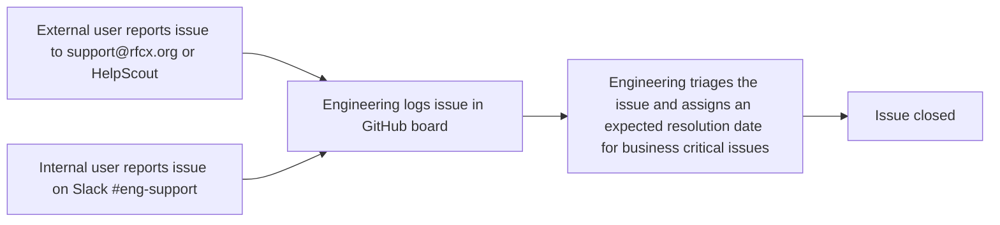

# Engineering Support

Tools and processes for managing bugs, problems and blockers involving the RFCx platforms.

---

## Tools

Issues are triaged and managed in the [Engineering Support GitHub project](https://github.com/orgs/rfcx/projects/10).

New issues are created by Engineering in this repo: [Create a new issue](https://github.com/rfcx/engineering-support/issues/new/choose).

---

## Support Options

### Slack channel

If you have access to Slack then posting issues in the #eng-support channel will get the fastest response. Engineering will prioritise issues affecting our internal team.

### HelpScout

External users can send a message to a support agent via support.rfcx.org or they can email support@rfcx.org. Both

## Support Process

